# 🚀 Système de Partage Social Complet - Halterra Lite

## Table des Matières

1. [Vue d'ensemble](#vue-densemble)
2. [Architecture](#architecture)
3. [Implémentation Serveur](#implémentation-serveur)
4. [Intégration Client](#intégration-client)
5. [Génération de Visuels](#génération-de-visuels)
6. [Stratégie Marketing](#stratégie-marketing)
7. [Analytics & Tracking](#analytics--tracking)
8. [Roadmap & Améliorations](#roadmap--améliorations)

---

## Vue d'ensemble

### Objectifs

✅ Partage fluide sur 7+ plateformes majeures
✅ Génération automatique de visuels premium (images 1080x1920)
✅ Liens courts trackables avec Open Graph
✅ Design minimaliste et inspirant
✅ Performance optimale (< 2s pour partage)
✅ Marketing viral organique

### Plateformes Supportées

| Plateforme | Format | Spécificités |
|------------|--------|--------------|
| Instagram | Story/Post | Copie automatique du texte + hashtags |
| Facebook | Link + Image | Open Graph optimisé |
| Twitter/X | Tweet | 280 chars max, 2 hashtags |
| LinkedIn | Post professionnel | Focus bien-être |
| WhatsApp | Message | Lien direct clickable |
| TikTok | Caption | Hashtags tendance |
| Native Share | OS natif | iOS/Android picker |

---

## Architecture

### Stack Technique

```
Frontend:
- React 19 + TypeScript
- Service Worker (PWA)
- Web Share API (native)
- Canvas API (preview)

Backend:
- Vercel Edge Functions
- Vercel Blob Storage
- Anthropic Claude API (quotes)
- Cloudinary/IMGIX (resize)

Analytics:
- Plausible/Umami (privacy-first)
- Custom events tracking
```

### Flow de Partage

```mermaid
graph TD
    A[Utilisateur clique Partager] --> B[ShareModal s'ouvre]
    B --> C{Plateforme?}
    C -->|Instagram/FB/LinkedIn| D[Générer image]
    C -->|Autres| E[Préparer texte]
    D --> F[Créer lien court]
    E --> F
    F --> G[Ouvrir plateforme]
    G --> H[Track analytics]
    H --> I[Confirmation]
```



---

## Implémentation Serveur

### API Endpoint: Génération d'Image

**`/api/share/generate`** (POST)

```typescript
// halterra-backend/api/share/generate.ts

import { ImageResponse } from '@vercel/og';
import { NextRequest } from 'next/server';

export const config = {
  runtime: 'edge',
};

interface ShareImageRequest {
  type: 'image' | 'video';
  format: 'square' | 'story';
  session: {
    id: string;
    excerpt: string;
    mood: {
      id: string;
      name: string;
      icon: string;
      color: string;
    };
    category?: string;
    intention?: string;
    userName: string;
  };
  includeQuote?: boolean;
}

export default async function handler(req: NextRequest) {
  if (req.method !== 'POST') {
    return new Response('Method not allowed', { status: 405 });
  }

  try {
    const body: ShareImageRequest = await req.json();
    const { session, format, includeQuote } = body;

    // Dimensions selon le format
    const dimensions = format === 'story'
      ? { width: 1080, height: 1920 }  // Instagram Story
      : { width: 1080, height: 1080 }; // Post carré

    // Générer l'image avec @vercel/og
    return new ImageResponse(
      (
        <div
          style={{
            width: '100%',
            height: '100%',
            display: 'flex',
            flexDirection: 'column',
            alignItems: 'center',
            justifyContent: 'center',
            background: `linear-gradient(135deg, ${session.mood.color}40 0%, #0A0E1A 100%)`,
            padding: '80px',
            position: 'relative',
          }}
        >
          {/* Background blur effect */}
          <div
            style={{
              position: 'absolute',
              top: '10%',
              left: '10%',
              width: '600px',
              height: '600px',
              background: session.mood.color,
              opacity: 0.15,
              filter: 'blur(150px)',
              borderRadius: '50%',
            }}
          />

          {/* Logo Halterra */}
          <div
            style={{
              position: 'absolute',
              top: '60px',
              left: '60px',
              display: 'flex',
              alignItems: 'center',
              gap: '16px',
            }}
          >
            <div
              style={{
                fontSize: '48px',
                fontWeight: 'bold',
                color: 'white',
                letterSpacing: '-0.02em',
              }}
            >
              Halterra
            </div>
          </div>

          {/* Mood Icon */}
          <div
            style={{
              fontSize: '120px',
              marginBottom: '40px',
            }}
          >
            {session.mood.icon}
          </div>

          {/* Intention (si présente) */}
          {session.intention && (
            <div
              style={{
                fontSize: '36px',
                fontWeight: '600',
                color: session.mood.color,
                textAlign: 'center',
                marginBottom: '32px',
                maxWidth: '800px',
              }}
            >
              {session.intention}
            </div>
          )}

          {/* Excerpt de la méditation */}
          <div
            style={{
              fontSize: '28px',
              color: 'rgba(255, 255, 255, 0.9)',
              textAlign: 'center',
              lineHeight: '1.6',
              maxWidth: '850px',
              marginBottom: '60px',
            }}
          >
            "{session.excerpt}"
          </div>

          {/* Quote inspirante (optionnel) */}
          {includeQuote && (
            <div
              style={{
                fontSize: '20px',
                color: 'rgba(255, 255, 255, 0.6)',
                fontStyle: 'italic',
                textAlign: 'center',
                maxWidth: '700px',
                marginTop: '40px',
              }}
            >
              — Méditation guidée avec Halterra
            </div>
          )}

          {/* CTA et branding */}
          <div
            style={{
              position: 'absolute',
              bottom: '60px',
              display: 'flex',
              flexDirection: 'column',
              alignItems: 'center',
              gap: '20px',
            }}
          >
            <div
              style={{
                fontSize: '24px',
                color: 'rgba(255, 255, 255, 0.8)',
                fontWeight: '500',
              }}
            >
              Découvre ta méditation personnalisée
            </div>
            <div
              style={{
                fontSize: '28px',
                color: 'white',
                fontWeight: '600',
                padding: '16px 40px',
                background: 'rgba(255, 255, 255, 0.1)',
                borderRadius: '100px',
                border: '2px solid rgba(255, 255, 255, 0.2)',
              }}
            >
              halterra.app
            </div>
          </div>
        </div>
      ),
      {
        ...dimensions,
      }
    );
  } catch (error) {
    console.error('Error generating share image:', error);
    return new Response('Error generating image', { status: 500 });
  }
}
```

### API Endpoint: Créer Lien Court

**`/api/share/link`** (POST)

```typescript
// halterra-backend/api/share/link.ts

import { NextRequest } from 'next/server';
import { kv } from '@vercel/kv'; // Vercel KV pour stockage liens

export const config = {
  runtime: 'edge',
};

interface ShareLinkRequest {
  sessionId: string;
  excerpt: string;
  mood: {
    id: string;
    name: string;
    icon: string;
    color: string;
  };
  intention?: string;
}

function generateShortId(): string {
  return Math.random().toString(36).substring(2, 8);
}

export default async function handler(req: NextRequest) {
  if (req.method !== 'POST') {
    return new Response('Method not allowed', { status: 405 });
  }

  try {
    const body: ShareLinkRequest = await req.json();

    // Générer ID court
    const shortId = generateShortId();

    // Stocker dans KV avec TTL de 90 jours
    await kv.setex(
      `share:${shortId}`,
      90 * 24 * 60 * 60, // 90 jours en secondes
      JSON.stringify({
        sessionId: body.sessionId,
        excerpt: body.excerpt,
        mood: body.mood,
        intention: body.intention,
        createdAt: Date.now(),
      })
    );

    // Retourner le lien court
    const baseUrl = process.env.VERCEL_URL || 'https://halterra.app';
    const shortUrl = `${baseUrl}/s/${shortId}`;

    return Response.json({
      success: true,
      shortUrl,
      shortId,
    });
  } catch (error) {
    console.error('Error creating share link:', error);
    return Response.json(
      { success: false, error: 'Failed to create share link' },
      { status: 500 }
    );
  }
}
```

### API Endpoint: Page de Redirection avec Open Graph

**`/api/share/og/[id]`** (GET)

```typescript
// halterra-backend/app/s/[id]/page.tsx

import { kv } from '@vercel/kv';
import { Metadata } from 'next';
import { notFound, redirect } from 'next/navigation';

interface ShareData {
  sessionId: string;
  excerpt: string;
  mood: {
    id: string;
    name: string;
    icon: string;
    color: string;
  };
  intention?: string;
  createdAt: number;
}

interface Props {
  params: { id: string };
}

// Génération des métadonnées Open Graph
export async function generateMetadata({ params }: Props): Promise<Metadata> {
  const data = await kv.get<ShareData>(`share:${params.id}`);

  if (!data) {
    return {
      title: 'Halterra - Méditation Personnalisée',
      description: 'Découvre des méditations guidées adaptées à ton état émotionnel',
    };
  }

  return {
    title: `${data.mood.icon} ${data.intention || 'Ma méditation'} | Halterra`,
    description: data.excerpt,
    openGraph: {
      title: data.intention || 'Ma méditation avec Halterra',
      description: data.excerpt,
      type: 'article',
      images: [
        {
          url: `https://halterra-backend.vercel.app/api/share/image/${params.id}`,
          width: 1080,
          height: 1080,
          alt: data.intention || 'Méditation Halterra',
        },
      ],
    },
    twitter: {
      card: 'summary_large_image',
      title: `${data.mood.icon} ${data.intention || 'Ma méditation'}`,
      description: data.excerpt,
      images: [`https://halterra-backend.vercel.app/api/share/image/${params.id}`],
    },
  };
}

export default async function SharePage({ params }: Props) {
  const data = await kv.get<ShareData>(`share:${params.id}`);

  if (!data) {
    notFound();
  }

  // Track la visite
  await fetch('https://halterra-backend.vercel.app/api/analytics/view', {
    method: 'POST',
    headers: { 'Content-Type': 'application/json' },
    body: JSON.stringify({
      shareId: params.id,
      timestamp: Date.now(),
    }),
  });

  // Redirection vers l'app avec query params
  redirect(`https://halterra.app?share=${params.id}`);
}
```

---

## Intégration Client

### 1. Ajouter le bouton de partage dans SessionView

```tsx
// src/components/SessionView.tsx

import { useState } from 'react';
import ShareModal from './ShareModal';
import type { MeditationSession } from '../types';
import type { ShareableSession } from '../types/share';

function SessionView({ session }: { session: MeditationSession }) {
  const [shareModalOpen, setShareModalOpen] = useState(false);

  // Convertir MeditationSession en ShareableSession
  const shareableSession: ShareableSession = {
    id: session.id,
    meditationText: session.meditationText,
    mood: getMoodById(session.mood), // fonction utilitaire
    category: session.category,
    intention: session.intention,
    userName: session.userName,
    date: session.date,
    guideType: session.guideType,
    duration: session.duration,
  };

  return (
    <div className="session-view">
      {/* Contenu existant... */}

      {/* Bouton de partage */}
      <button
        className="share-button"
        onClick={() => setShareModalOpen(true)}
      >
        <svg width="20" height="20" viewBox="0 0 24 24" fill="none">
          <path
            d="M18 8C19.6569 8 21 6.65685 21 5C21 3.34315 19.6569 2 18 2C16.3431 2 15 3.34315 15 5C15 5.12548 15.0077 15.2499 15.0227 15.3727L8.08259 19.187C7.54305 18.4928 6.81567 18 6 18C4.34315 18 3 19.3431 3 21C3 22.6569 4.34315 24 6 24C7.65685 24 9 22.6569 9 21C9 20.8745 8.99231 20.7501 8.97733 20.6273L15.9174 16.813C16.4569 17.5072 17.1843 18 18 18C19.6569 18 21 16.6569 21 15C21 13.3431 19.6569 12 18 12C17.1843 12 16.4569 12.4928 15.9174 13.187L8.97733 9.37274C8.99231 9.24991 9 9.12548 9 9C9 7.34315 7.65685 6 6 6C4.34315 6 3 7.34315 3 9C3 10.6569 4.34315 12 6 12C6.81567 12 7.54305 11.5072 8.08259 10.813L15.0227 14.6273C15.0077 14.7501 15 14.8745 15 15C15 15.1255 15.0077 15.2499 15.0227 15.3727L8.08259 19.187Z"
            fill="currentColor"
          />
        </svg>
        <span>Partager</span>
      </button>

      {/* Modal de partage */}
      <ShareModal
        session={shareableSession}
        isOpen={shareModalOpen}
        onClose={() => setShareModalOpen(false)}
      />
    </div>
  );
}
```

### 2. Ajouter dans Meditation (après sauvegarde)

```tsx
// src/components/Meditation.tsx

// Après sauvegarde réussie
const handleSave = async () => {
  // ... code existant de sauvegarde ...

  if (success) {
    // Afficher notification de succès
    setShowSuccessNotification(true);

    // Proposer de partager après 2 secondes
    setTimeout(() => {
      setShowSharePrompt(true);
    }, 2000);
  }
};

// Dans le JSX
{showSharePrompt && (
  <div className="share-prompt">
    <p>✨ Envie de partager cette méditation?</p>
    <button onClick={() => setShareModalOpen(true)}>
      Partager
    </button>
  </div>
)}
```

### 3. Ajouter dans History (cards)

```tsx
// src/components/History.tsx

<div className="session-actions">
  <button
    className="session-action-btn"
    onClick={(e) => {
      e.stopPropagation();
      handleShare(session);
    }}
    aria-label="Partager"
  >
    <svg width="18" height="18" viewBox="0 0 24 24" fill="none">
      {/* Icon partage */}
    </svg>
  </button>
</div>
```

---

## Génération de Visuels

### Alternatives à @vercel/og

Si vous n'utilisez pas Vercel, voici des alternatives:

#### Option 1: Canvas API (Client-side)

```typescript
// src/utils/generateShareImage.ts

import html2canvas from 'html2canvas';

export async function generateShareImageFromDOM(
  session: ShareableSession
): Promise<string> {
  // Créer un élément DOM temporaire
  const container = document.createElement('div');
  container.style.width = '1080px';
  container.style.height = '1080px';
  container.style.position = 'absolute';
  container.style.left = '-9999px';

  container.innerHTML = `
    <div style="
      width: 100%;
      height: 100%;
      background: linear-gradient(135deg, ${session.mood.color}40 0%, #0A0E1A 100%);
      display: flex;
      flex-direction: column;
      align-items: center;
      justify-content: center;
      padding: 80px;
      font-family: Inter, sans-serif;
    ">
      <!-- Contenu similaire au JSX ci-dessus -->
    </div>
  `;

  document.body.appendChild(container);

  // Générer l'image
  const canvas = await html2canvas(container, {
    backgroundColor: null,
    scale: 2,
  });

  document.body.removeChild(container);

  // Convertir en blob/dataURL
  return canvas.toDataURL('image/png');
}
```

#### Option 2: Cloudinary Transformation

```typescript
// Utiliser les transformations Cloudinary pour composer l'image

const cloudinaryUrl = `https://res.cloudinary.com/${CLOUD_NAME}/image/upload/
  w_1080,h_1080,c_fill/
  l_text:Inter_48_bold:${encodeURIComponent(session.intention)},co_white,g_north,y_200/
  l_text:Inter_28:${encodeURIComponent(session.excerpt)},co_rgb:FFFFFF,g_center,w_850,c_fit/
  background.png
`;
```

---

## Stratégie Marketing

### 1. Gamification du Partage

**Système de badges** (à implémenter dans l'app):

```typescript
// src/utils/shareRewards.ts

export const SHARE_MILESTONES = [
  { shares: 1, badge: '🌟', title: 'Premier Partage', reward: '1 méditation bonus' },
  { shares: 5, badge: '✨', title: 'Inspirateur', reward: 'Thème exclusif' },
  { shares: 10, badge: '💫', title: 'Ambassadeur', reward: '7 jours premium' },
  { shares: 25, badge: '🎯', title: 'Évangéliste', reward: '1 mois premium' },
];

export function getNextMilestone(shareCount: number) {
  return SHARE_MILESTONES.find(m => m.shares > shareCount);
}
```

**Progress tracking**:

```tsx
<div className="share-progress">
  <p>Tu as inspiré {shareCount} personnes 🌟</p>
  {nextMilestone && (
    <div className="progress-bar">
      <div style={{ width: `${(shareCount / nextMilestone.shares) * 100}%` }} />
      <p>Plus que {nextMilestone.shares - shareCount} partages pour débloquer: {nextMilestone.reward}</p>
    </div>
  )}
</div>
```

### 2. Templates Viraux

**Moment optimal pour proposer le partage**:
- ✅ Juste après une méditation réussie (émotions positives)
- ✅ Quand l'utilisateur revient voir une ancienne méditation
- ✅ Après 3 méditations complétées (engagement établi)

**Messages optimisés par plateforme**:

```typescript
const VIRAL_TEMPLATES = {
  instagram: {
    caption: `{mood_icon} Moment de pause avec @halterra.app

{intention}

Cette méditation m'a vraiment aidé·e aujourd'hui. Si tu cherches à prendre soin de toi, je te recommande l'app! ✨

{hashtags}
`,
  },
  twitter: {
    tweet: `{mood_icon} {excerpt}

— Ma méditation du jour avec @HalterraApp

{link} ✨`,
  },
};
```

### 3. Incentives Stratégiques

**Programme de référence**:
- Lien de partage unique par utilisateur
- 1 mois premium offert pour 3 amis inscrits via ton lien
- Ami invité obtient 7 jours premium gratuits

**Challenges communautaires**:
- "Défi 30 jours" - Partage ta méditation quotidienne
- Badge exclusif pour participants
- Leaderboard des inspirateurs du mois

### 4. Contenu Viral Ready

**Éléments à optimiser**:

1. **Visuels Instagram-ready**
   - Format 1080x1920 (Stories)
   - Couleurs vives et contrastées
   - Texte lisible même en petit
   - Logo bien visible

2. **Hooks émotionnels**
   - Citations inspirantes
   - Questions réflexives
   - Call-to-action doux

3. **Timing**
   - Meilleur moment: Dimanche soir (préparation semaine)
   - Stories: 19h-21h
   - Posts: Mercredi/Dimanche 11h-13h

### 5. Partenariats Influenceurs

**Micro-influenceurs bien-être** (5k-50k followers):
- Kit de partage personnalisé
- Code promo unique
- Commission sur abonnements premium
- Accès early-access nouvelles fonctionnalités

---

## Analytics & Tracking

### Events à Tracker

```typescript
// src/services/analytics.ts

export enum ShareEvent {
  SHARE_INITIATED = 'share_initiated',
  SHARE_COMPLETED = 'share_completed',
  SHARE_FAILED = 'share_failed',
  SHARE_LINK_CLICKED = 'share_link_clicked',
  SHARE_LINK_CONVERTED = 'share_link_converted', // User s'inscrit via lien
}

export async function trackShareEvent(
  event: ShareEvent,
  data: {
    platform?: string;
    sessionId?: string;
    shareId?: string;
    mood?: string;
    category?: string;
  }
) {
  // Envoyer à votre système d'analytics
  await fetch('https://halterra-backend.vercel.app/api/analytics/event', {
    method: 'POST',
    headers: { 'Content-Type': 'application/json' },
    body: JSON.stringify({
      event,
      ...data,
      timestamp: Date.now(),
      userAgent: navigator.userAgent,
    }),
  });
}
```

### Métriques Clés à Suivre

1. **Taux de partage** (Share Rate)
   - Calcul: (Partages / Sessions complétées) × 100
   - Objectif: > 15%

2. **Viralité K-Factor**
   - Calcul: (Invitations envoyées × Taux conversion) / Utilisateur
   - Objectif: > 1.0 (croissance exponentielle)

3. **Plateforme la plus performante**
   - Partages par plateforme
   - Conversion par plateforme
   - Engagement (clics sur liens)

4. **Time-to-share**
   - Temps entre fin méditation et partage
   - Optimiser le moment de proposition

### Dashboard Analytics

```typescript
interface ShareAnalytics {
  totalShares: number;
  sharesByPlatform: Record<SharePlatform, number>;
  conversionRate: number; // Clics -> Inscriptions
  topSharedMoods: Array<{ mood: string; count: number }>;
  viralCoefficient: number;
  averageTimeToShare: number; // en minutes
}
```

---

## Roadmap & Améliorations

### Phase 1: MVP (Semaine 1-2) ✅

- [x] ShareModal avec 6+ plateformes
- [x] Génération liens courts
- [x] Open Graph metadata
- [x] Analytics de base

### Phase 2: Visuels (Semaine 3-4)

- [ ] Génération d'images serveur (@vercel/og)
- [ ] Templates personnalisables
- [ ] Preview avant partage
- [ ] Optimisation formats (Stories, Posts, etc.)

### Phase 3: Vidéo (Semaine 5-8)

- [ ] Génération de clips courts (5-15s)
- [ ] Animation du texte avec mood colors
- [ ] Background vidéo apaisant
- [ ] Export TikTok/Reels ready

### Phase 4: Gamification (Semaine 9-12)

- [ ] Système de badges
- [ ] Leaderboard communautaire
- [ ] Challenges mensuels
- [ ] Récompenses premium

### Phase 5: Intelligence (Mois 4-6)

- [ ] AI-powered moment optimal pour partager
- [ ] Suggestions de caption personnalisées
- [ ] A/B testing automatique des visuels
- [ ] Prédiction viralité

---

## Bonnes Pratiques Observées

### Apps de Référence Analysées

1. **Calm** 🧘
   - Partage après méditation
   - Visuels minimalistes
   - Focus sur la citation/mantra

2. **Headspace** 🎈
   - Animations légères
   - Branding fort mais discret
   - Stats de progrès dans le partage

3. **Insight Timer** ⏰
   - Partage de milestones (ex: "100ème méditation!")
   - Intégration deep links
   - Badges communautaires

### Ce Qui Marche

✅ **Simplicité** - Maximum 3 clics pour partager
✅ **Visuel Premium** - Design pro, pas amateur
✅ **Émotionnel** - Capturer l'état post-méditation
✅ **Social Proof** - Montrer combien ont partagé
✅ **Rewards** - Incentives clairs et atteignables

### Ce Qui Ne Marche PAS

❌ Partage forcé ou trop insistant
❌ Visuels surchargés de texte
❌ Trop de hashtags (spam feeling)
❌ Watermark trop visible
❌ Processus compliqué

---

## Installation & Déploiement

### 1. Installation dépendances

```bash
npm install @vercel/og @vercel/kv html2canvas
```

### 2. Variables d'environnement

```env
# .env.local (frontend)
VITE_API_URL=https://halterra-backend.vercel.app
VITE_APP_URL=https://halterra.app

# Backend
VERCEL_URL=halterra-backend.vercel.app
KV_URL=redis://...  # Vercel KV
KV_REST_API_URL=https://...
KV_REST_API_TOKEN=...

# Analytics
ANALYTICS_ENDPOINT=https://analytics.halterra.app
```

### 3. Déployer le backend

```bash
cd halterra-backend
vercel --prod
```

### 4. Tester localement

```bash
# Frontend
npm run dev

# Backend (si Next.js)
cd halterra-backend
npm run dev

# Tester avec ngrok pour webhook testing
ngrok http 3000
```

---

## Support & Contact

**Questions?** Ouvre une issue sur le repo ou contacte l'équipe.

**Contribuer?** Les PRs sont bienvenues! Voir `CONTRIBUTING.md`

---

🚀 **Let's make Halterra viral!** ✨
